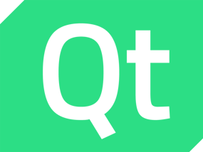

+++
date = '2026-05-01T16:05:58+08:00'
draft = true
title = 'Qt'

summary = 'this is my Qt blog'

pin = true

tags = ["Qt学习系列"]

+++

# Qt学习

## 1.Qt概念

Qt 是一套**跨平台 C++ 应用开发框架**，1991 年由挪威 Trolltech 公司发布，现由 The Qt Company 维护，支持商业与开源（LGPL/GPL）双授权。

### 一、核心特点

- **跨平台**：一次编码，可编译运行于 Windows、Linux、macOS、Android、iOS 及嵌入式 Linux/QNX/VxWorks 等。

- **信号与槽（Signals & Slots）**：替代回调，实现对象间**松耦合通信**，是 Qt 最核心机制。

- GUI 双方案

  - **Qt Widgets**：传统桌面控件（按钮、表格等），成熟稳定。
  - **Qt Quick/QML**：声明式语言，适合**动态、现代、流畅 UI**（移动端 / 嵌入式）。

  

- **功能全面**：内置网络、数据库、多线程、多媒体、OpenGL、JSON/XML 等模块。

- **工具链完整**：配套 **Qt Creator IDE**，含可视化 UI 设计器（Qt Designer）、调试、部署、打包工具。

- **语言绑定**：除 C++ 外，可通过 PyQt/PySide（Python）、Qt for Python、QML+JS 等开发。

### 二、核心模块（Essentials）

- **Qt Core**：基础非图形类（字符串、容器、文件、线程、事件循环）。
- **Qt GUI**：图形基础（窗口、绘图、OpenGL）。
- **Qt Widgets**：传统桌面控件集Qt。
- **Qt Quick**：QML 引擎与基础类型Qt。
- **Qt Network**：TCP/UDP/HTTP/WebSocket 等网络通信。
- **Qt SQL**：数据库访问（MySQL、PostgreSQL、SQLite 等）。
- **Qt Multimedia**：音视频播放、录制、摄像头。

### 三、版本

- **Qt 5**：长期支持（LTS），工业界广泛使用，稳定可靠。
- **Qt 6**：最新主流版本，架构重构，**QML 引擎升级**、图形栈优化、更好支持 C++17/20，推荐新项目使用。

### 四、典型应用场景

- **桌面软件**：WPS Office、VirtualBox、VLC、Autodesk Maya 工具、工业控制软件。
- **嵌入式 & 车载**：汽车仪表 / 中控、智能家居面板、医疗设备、工业 HMI。
- **移动应用**：跨平台 App、智能电视 / 盒子应用。
- **非 GUI 程序**：服务器、命令行工具、后台服务（仅用 Core/Network/SQL 等）。
